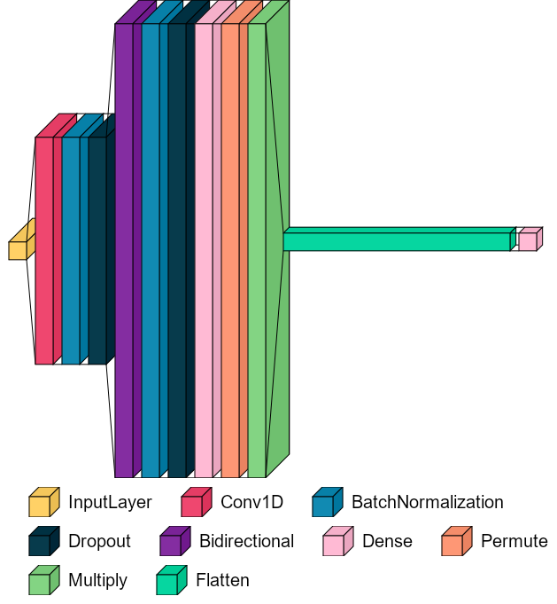
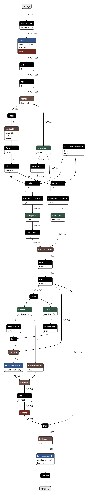
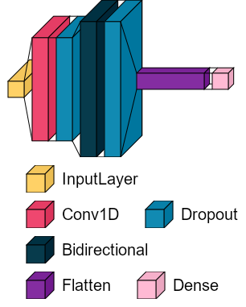
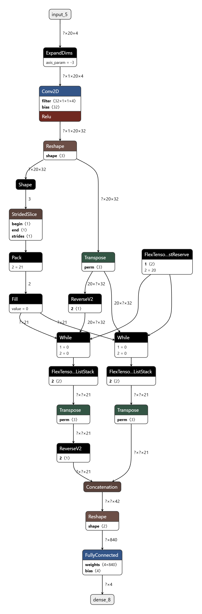
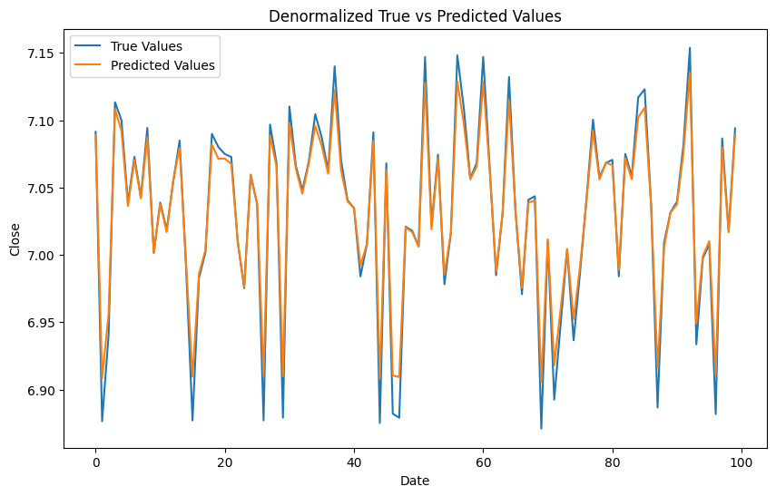
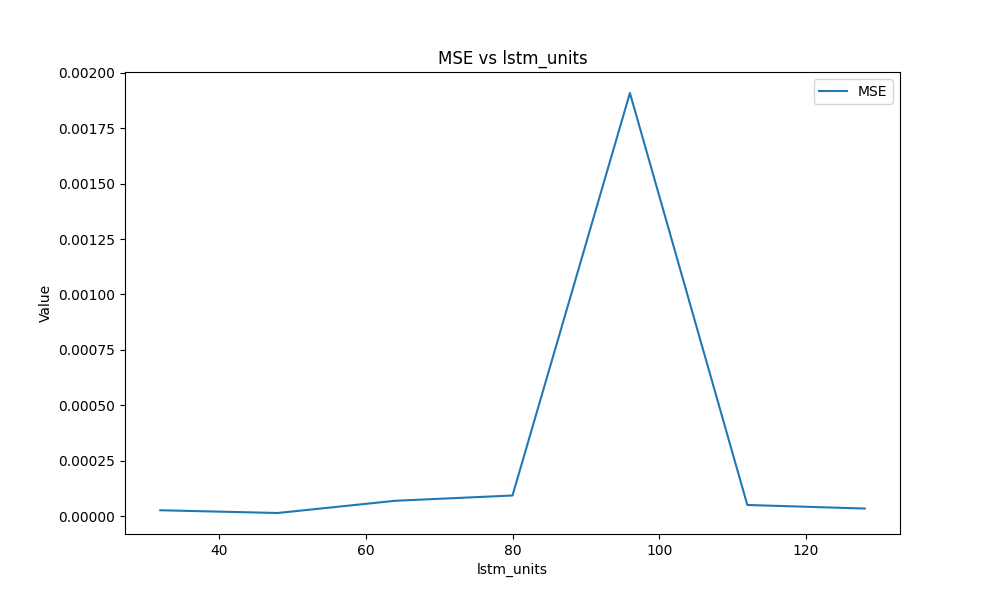
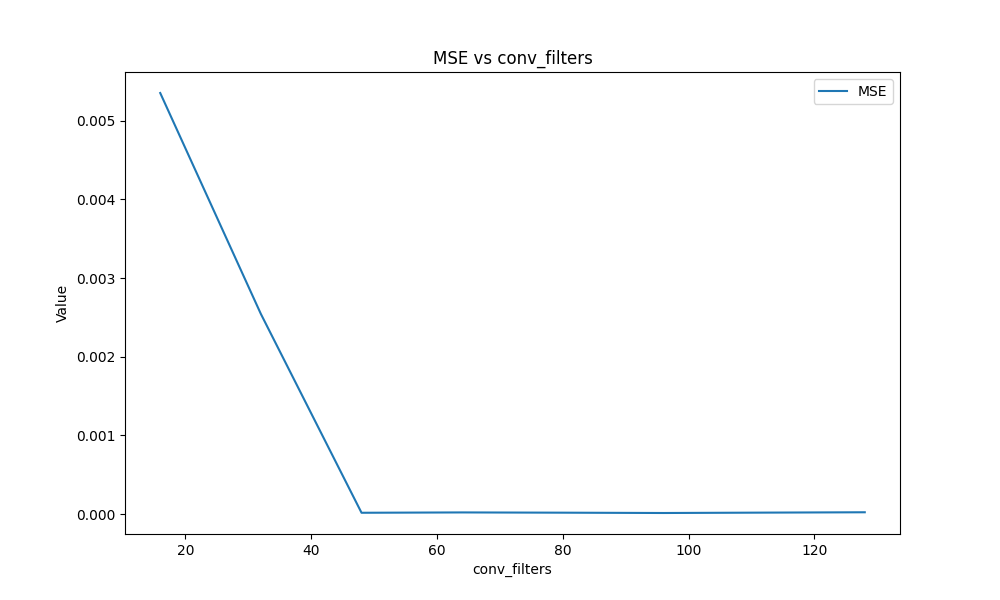
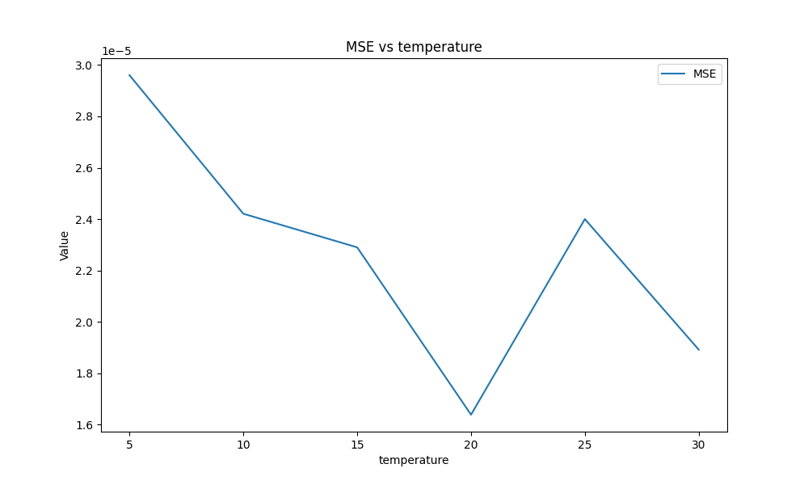

# CNN-BiLSTM-Attention-K-Line-Prediction

这是一个课程作业

## 项目介绍

目标是实现一个对K线图进行预测的神经网络，这里实现的实际上是基于开盘、收盘、高点、低点这四个数据的预测，使用相对较小的模型即可取得较好的效果，实际应用应该需要参考更多数据来构建更大的模型。

该实验其实有一个比较不错的发现，即：即使非常小的模型对于开盘、收盘、高点、低点的预测值与真值差距可能很大，但是涨跌准确率却可以达到非常高的程度（接近98%），即预测涨跌是非常简单的。

## 环境

**安装前请先看特别提醒部分**

经测试python 3.7，3.11没问题，推荐3.11

```
pip install -r requirements.txt  -i https://pypi.tuna.tsinghua.edu.cn/simple
```

### TF1环境

requirements.txt如下，基于python3.7

```
Keras==2.3.1
numpy==1.16.5
pandas==0.25.1
scikit_learn==1.0.2
tensorflow==1.15.0
tensorflow_intel==2.11.0
matplotlib~=3.0.3
```

### TF2环境

基于python3.11

```
keras==2.14.0
matplotlib==3.10.0
numpy==2.2.0
pandas==2.2.3
scikit_learn==1.6.0
tensorflow==2.14.1
tensorflow_intel==2.14.1
tensorflow_model_optimization==0.8.0
visualkeras==0.1.4
```

### 特别提醒：关于特定版本下的TF问题

- python3.12和高于2.16.0的tensorflow基本都会出现如下issue：https://github.com/tensorflow/tensorflow/issues/63548
- [TensorFlow Model Optimization](https://github.com/tensorflow/model-optimization/releases/tag/v0.8.0)最新版本对应支持的tensorflow为2.14，如果希望使用其进行量化和剪枝请注意版本

## 项目文件介绍

### 代码

- `predict_T+1_tf2.ipynb`：（推荐）TF2下通过前t天数据预测T+1天开盘、收盘、高点、低点，使用蒸馏、量化，以及效果对比
- `archive`：归档代码
  - `note.ipynb`：TF1下的功能实现
  - `predict_T+1_tf1.py`：TF1下通过前t天数据预测T+1天开盘、收盘、高点、低点
  - `predict_T+1_tf2.py`：TF2下通过前t天数据预测T+1天开盘、收盘、高点、低点
  - `predict_T+1_tf2_distiller.py`：TF2下通过前t天数据预测T+1天开盘、收盘、高点、低点，使用蒸馏

### 实验结果

- `check_points`：训练好的模型的结果
  - `model_origin_saved_model`：直接训练后通过`tf.saved_model.save()`保存的模型
  - `model_origin_tflite`：直接训练后保存的TFLite模型
  - `student_saved_model`：蒸馏后通过`tf.saved_model.save()`保存的学生模型
  - `teacher_saved_model`：蒸馏后通过`tf.saved_model.save()`保存的教师模型
  - `student_after_prune_saved_model`：蒸馏、剪枝后通过`tf.saved_model.save()`保存的的学生模型
  - `student_tflite_models_pruning_quantization`：蒸馏、剪枝、量化后的TFLite模型
  - `student_tflite_models_direct_quantization`：蒸馏后直接量化的TFLite模型
  
- `param_results`：参数变化对比

- `.assets`：一些图片

## 数据集要求

至少包含`['open', 'close', 'high', 'low']`这四列

## 功能

### 功能实现

`note.ipynb`中实现了如下功能：

#### 通过第t+1天开盘、最高、最低预测收盘

在一段连续的时间内，某只股票会产生一个收盘价格的序列。我们记这段连续的价格序列为：

$$
C_T=c_1,c_2,...,c_T
$$

其中 $c_t$ 代表该股票在第 $t$ 个交易日的收盘价格。

此外我们定义开盘价序列 $O_T=o_1,o_2,...,o_T$ ，最高价序列 $H_T=h_1,h_2,...,h_T$ ，最低价序列 $L_T=l_1,l_2,...,l_T$

基于这四个序列数据，训练一个模型 $f_M$，以第 $T+1$ 天的开盘价 $o_{T+1}$、最高点 $h_{T+1}$、最低点 $l_{T+1}$ 作为输入，预测该天的收盘价格 $c_{T+1}$

即：

$$
\{O_T,H_T,L_T,C_T\}\to f_M
$$

$$
c_{T+1}=f_M(o_{T+1},h_{T+1},l_{T+1})
$$

#### 通过前t天数据预测T+1天开盘、收盘、高点、低点

考虑更现实一点的，训练一个模型 $f_N$，以前 $t$ 天数据为输入，预测第二天的开盘价 $o_{T+1}$、最高点 $h_{T+1}$、最低点 $l_{T+1}$ 、收盘价 $c_{T+1}$

$$
\{(O_i,H_i,L_i,C_i)\}\to f_N,i\in (0,T-1)
$$

$$
(c_{T+1},o_{T+1},h_{T+1},l_{T+1})=f_N(c_T,o_{T},h_{T},l_{T})
$$

#### 通过前t天数据预测T+7天开盘、收盘、高点、低点

同理，同时也可以二次开发为预测T+n天的价格数据（但请注意置信度问题）

### 不同功能实现的关键点

#### 数据集构造

针对不同场景构造不同数据集：

```python
def create_dataset(dataset, look_back):
    dataX, dataY = [], []
    for i in range(len(dataset) - look_back - 1):
        a = dataset[i:(i + look_back), :]
        dataX.append(a)
        dataY.append(dataset[i + look_back, :])
    TrainX = np.array(dataX)
    Train_Y = np.array(dataY)

    return TrainX, Train_Y
train_X, _ = create_dataset(data, TIME_STEPS)
_, train_Y = create_dataset(close_column, TIME_STEPS)


def create_dataset_tomorrow(dataset, look_back):
    dataX, dataY = [], []
    for i in range(len(dataset) - look_back):
        a = dataset[i:(i + look_back), :]
        dataX.append(a)
        dataY.append(dataset[i + look_back, :])
    TrainX = np.array(dataX)
    Train_Y = np.array(dataY)
    return TrainX, Train_Y
train_X, train_Y = create_dataset_tomorrow(data, TIME_STEPS)

def create_dataset_7days(dataset, look_back):
    dataX, dataY = [], []
    for i in range(len(dataset) - look_back - 7):  # 预测7天后的数据
        a = dataset[i:(i + look_back), :]
        dataX.append(a)
        dataY.append(dataset[i + look_back + 6, :])  # 目标是7天后的数据
    TrainX = np.array(dataX)
    Train_Y = np.array(dataY)
    return TrainX, Train_Y
train_X, train_Y = create_dataset_7days(data, TIME_STEPS)
```

代码实现思路上基本类似，不再赘述


## 模型格式



```
Model: "model_8"
__________________________________________________________________________________________________
 Layer (type)                Output Shape                 Param #   Connected to                  
==================================================================================================
 input_9 (InputLayer)        [(None, 20, 4)]              0         []                            
                                                                                                  
 conv1d_8 (Conv1D)           (None, 20, 64)               320       ['input_9[0][0]']             
                                                                                                  
 batch_normalization_8 (Bat  (None, 20, 64)               256       ['conv1d_8[0][0]']            
 chNormalization)                                                                                 
                                                                                                  
 dropout_16 (Dropout)        (None, 20, 64)               0         ['batch_normalization_8[0][0]'
                                                                    ]                             
                                                                                                  
 bidirectional_5 (Bidirecti  (None, 20, 128)              66048     ['dropout_16[0][0]']          
 onal)                                                                                            
                                                                                                  
 batch_normalization_9 (Bat  (None, 20, 128)              512       ['bidirectional_5[0][0]']     
 chNormalization)                                                                                 
                                                                                                  
 dropout_17 (Dropout)        (None, 20, 128)              0         ['batch_normalization_9[0][0]'
                                                                    ]                             
                                                                                                  
 dense_12 (Dense)            (None, 20, 128)              16512     ['dropout_17[0][0]']          
                                                                                                  
 attention_vec (Permute)     (None, 20, 128)              0         ['dense_12[0][0]']            
                                                                                                  
 multiply_4 (Multiply)       (None, 20, 128)              0         ['dropout_17[0][0]',          
                                                                     'attention_vec[0][0]']       
                                                                                                  
 flatten_8 (Flatten)         (None, 2560)                 0         ['multiply_4[0][0]']          
                                                                                                  
 dense_13 (Dense)            (None, 4)                    10244     ['flatten_8[0][0]']           
                                                                                                  
==================================================================================================
Total params: 93892 (366.77 KB)
Trainable params: 93508 (365.27 KB)
Non-trainable params: 384 (1.50 KB)
__________________________________________________________________________________________________
```



## 核心功能：通过前t天数据预测T+1天开盘、收盘、高点、低点

通过前t天数据预测T+1天开盘、收盘、高点、低点是最有实践价值且易于使用的功能，这部分内容主要可以参考`predict_T+1_tf2.ipynb`中的实现。该部分在前面功能实现的基础上，对模型大小进行了优化（从420KB到量化后67KB，参数量从93892到蒸馏后12596）

### 蒸馏与量化

一个主要的点是教师和学生模型的实现与结构：

```python
# 教师模型与上面的attention_model()是一样的
def teacher_model():
    inputs = Input(shape=(TIME_STEPS, INPUT_DIMS))
    x = Conv1D(filters=64, kernel_size=1, activation='relu')(inputs)
    x = BatchNormalization()(x)
    x = Dropout(dropout)(x)
    lstm_out = Bidirectional(LSTM(lstm_units, return_sequences=True))(x)
    lstm_out = BatchNormalization()(lstm_out)
    lstm_out = Dropout(dropout)(lstm_out)
    attention_mul = attention_3d_block(lstm_out)
    attention_mul = Flatten()(attention_mul)
    output = Dense(4, activation='linear')(attention_mul)  # 教师模型输出4个特征
    model = Model(inputs=[inputs], outputs=output)
    return model

# 定义学生模型
def student_model():
    inputs = Input(shape=(TIME_STEPS, INPUT_DIMS))
    x = Conv1D(filters=32, kernel_size=1, activation='relu')(inputs)  # 较少的过滤器
    x = Dropout(dropout)(x)
    lstm_out = Bidirectional(LSTM(lstm_units // 3, return_sequences=True))(x)  # 更少的LSTM单元
    lstm_out = Dropout(dropout)(lstm_out)
    # attention_mul = attention_3d_block(lstm_out)
    attention_mul = Flatten()(lstm_out)
    output = Dense(4, activation='linear')(attention_mul)  # 学生模型输出4个特征
    model = Model(inputs=[inputs], outputs=output)
    return model
```

其中学生模型减少的主要是：

- 卷积的filters大小
- LSTM的单元数量
- 删除了attention_3d_block



```
Model: "model_9"
_________________________________________________________________
 Layer (type)                Output Shape              Param #   
=================================================================
 input_10 (InputLayer)       [(None, 20, 4)]           0         
                                                                 
 conv1d_9 (Conv1D)           (None, 20, 32)            160       
                                                                 
 dropout_18 (Dropout)        (None, 20, 32)            0         
                                                                 
 bidirectional_6 (Bidirecti  (None, 20, 42)            9072      
 onal)                                                           
                                                                 
 dropout_19 (Dropout)        (None, 20, 42)            0         
                                                                 
 flatten_9 (Flatten)         (None, 840)               0         
                                                                 
 dense_14 (Dense)            (None, 4)                 3364      
                                                                 
=================================================================
Total params: 12596 (49.20 KB)
Trainable params: 12596 (49.20 KB)
Non-trainable params: 0 (0.00 Byte)
_________________________________________________________________

```



## 实验结果

### 特定参属下的不同策略对比

固定使用如下参数进行不同策略的结果对比

```python
INPUT_DIMS = 4
TIME_STEPS = 20
lstm_units = 64
conv_filters = 64
epoch = 30
dropout = 0.4
temperature = 5
alpha = 0.1
```

#### 直接训练模型



```
MAE: 0.010913534954714577
MSE: 0.0001581908717381451
涨跌准确率: 98.8192725195201%
396844字节
```

#### 蒸馏后


```
MAE: 0.0023896262347925163
MSE: 1.3173944023981867e-05
涨跌准确率: 98.43839268710721%
```

#### 直接使用学生模型


```
MAE: 0.015166467314500085
MSE: 0.0002986253349154829
涨跌准确率: 98.45743667872786%
```

#### 剪枝后


```
MAE: 0.0025220377144519308
MSE: 1.409958807691403e-05
涨跌准确率: 98.43839268710721%
```

#### 量化剪枝模型


```
MAE: 0.003216398370789621
MSE: 1.8205137322952464e-05
涨跌准确率: 98.45743667872786%
67536字节
```


#### 直接量化蒸馏模型


```
MAE: 0.0030445685929175958
MSE: 1.821908313592631e-05
涨跌准确率: 98.43839268710721%
```

#### 总结

初始模型过拟合比较严重，蒸馏后得到的模型效果不错，但模型较大，直接剪枝或量化都能在保持模型效果的同时对模型进行压缩并改善过拟合的问题，但剪枝后进行量化的结果表明，模型过拟合的问题上基本已经达到优化极限。

### 参数对比

运行`param_test.py`进行参数对比测试

针对如下的几个参数进行参数效果对比：

```python
lstm_units = 64
conv_filters = 64
epoch = 30
dropout = 0.4
temperature = 5
alpha = 0.1
```

从结果上看，只要不是特别离谱，对准确率的影响都不大，所以这里只展示对MSE的影响

#### lstm_units

80以下效果都不错，增加后很容易过拟合导致loss增加



#### conv_filters

64以上效果都不错



#### epoch


#### dropout


#### temperature



#### alpha


## 特别致谢

本项目基于该项目进行二次开发：https://github.com/PatientEz/CNN-BiLSTM-Attention-Time-Series-Prediction_Keras
